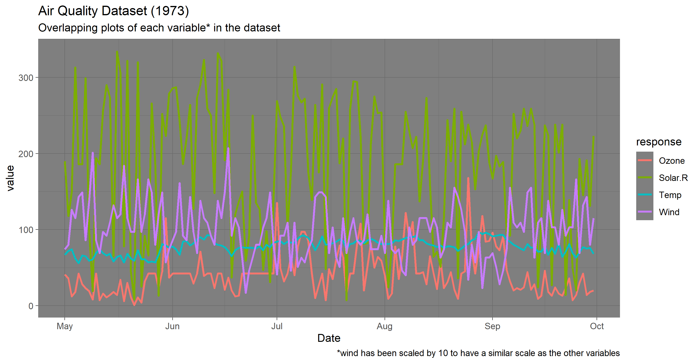
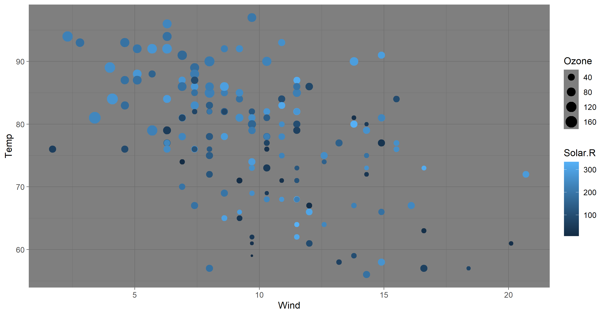
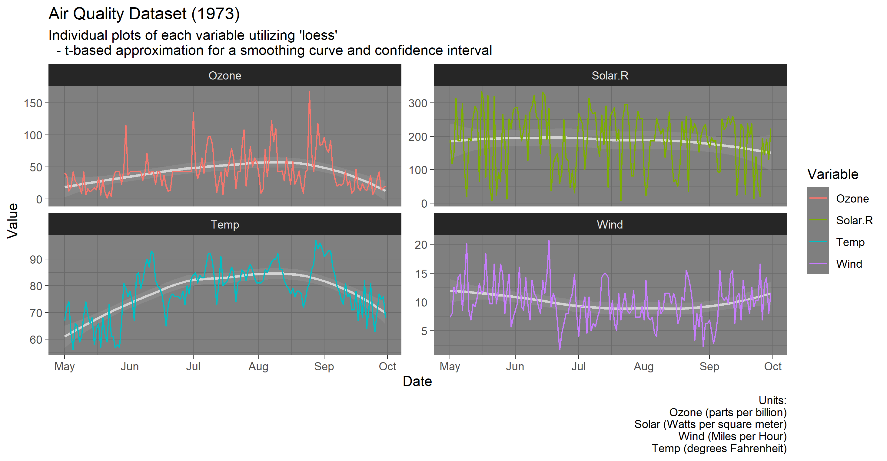

# Visual Communication in Data Science
### Abstract
The most important skill for a Data Scientist to develop is communication.  It is their responsibility to discover insights with data to drive decision-making, but not to make the decisions themselves.  For this reason, I would argue that accurate and effective communication is more important than any algorithm, model, or package.

### Not so abstract after all
Each type of communication is different, but provides a well-rounded way of providing the same information.  We can classify these into four categories, aligned with four types of learners:  visual, written, hearing, and tacital.  Here, we concern ourselves with the visual learner.

### Why should we care?
Plots are vital to not only getting the point across but also to ensure that the message stays with the individual.  Not only that, but people have a tendency to gloss over long paragraphs of text.  Are you still reading this, or have you already skipped to the graphics below?  Even so, we find that overly complicated or cluttered plots are used all too frequently within our industry.  Instead of bombarding you with the [typical military graphic](https://www.nytimes.com/2010/04/27/world/27powerpoint.html), we can take a look at an example that is easy to fix.

### Get to the point...
Cluttered plots are like long sentences and paragraphs that never seem to end and just keep adding more information than is truly needed to convey the point almost as if they are trying to be more esoteric just for the sake of it.  Exhausted yet?  I sure am.  Let's take a look at this in plot form.

### ... or rather, the plot.

### Is this cleaner, or just more complicated?

### They aren't overlaid, but the point is so much easier to gather.

